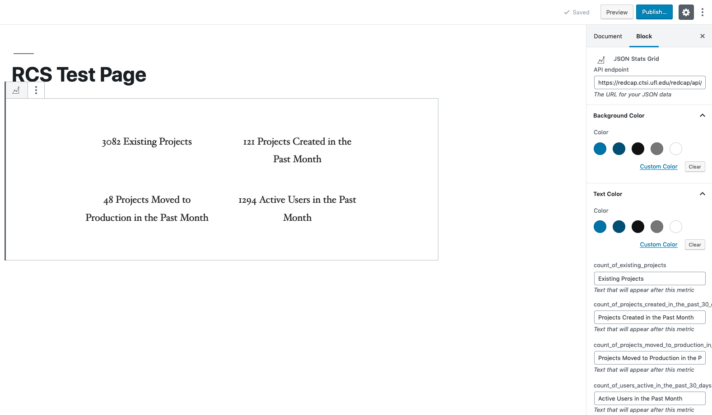

# Wordpress JSON Stats Grid

Intended for use with REDCap external module [redcap_webservices](https://github.com/ctsit/redcap_webservices) to present summary statistics of a REDCap instance on a WordPress website as a Gutenberg block.

## Use
Configure your `redcap_webservices` module to perform a SQL query that returns a 2 column table in the format: `field_name`, `field_value`. Use the endpoint of your SQL query as the argument for your **API endpoint** in the block settings on your WordPress page.

After setting a valid API endpoint in the block settings a series of fields, one for each `field_name` returned by your query, will appear below the color selectors for the block. Use these fields to set the text that will appear after the `field_value` for the corresponding `field_name`. Leaving any field blank will result in the data for that `field_name` not being reported.

Fields will be presented in 2 columns where each cell contains a row for which you have set a text label. **Sections will be populated left-to-right in the order that you assign their text labels, not the order that they appear in the block settings**.

---

## Attribution
This project was bootstrapped with [Create Guten Block](https://github.com/ahmadawais/create-guten-block).
